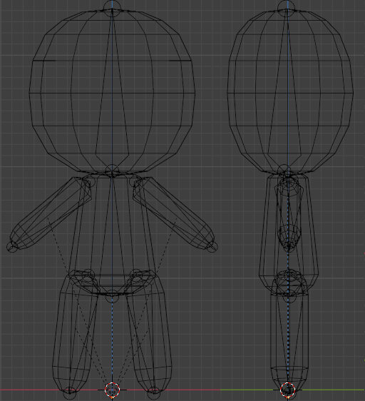

# `@fumohouse/fumo`: Fumo character

**Summary:** The fumo character rig is the namesake of Fumohouse.

1. [x] The module should contain the rig and animations of various builtin
   characters.
1. [x] The part meshes and data shall be placed in separate, always-loaded
   modules (e.g., `@fumohouse/fumo_touhou`) that register their contents with
   `@fumohouse/fumo`.

## Part breakdown

For the purposes of customization, the fumo character is broken up into the
following part slots:

- None: Use for internal components of `MultiPart`s (attachable parts composed
  of multiple bone attachments). Not to be used for player-accessible parts.
- Hair (Main): The part of the hair that covers the bald head. Either (not both)
  of the following:
  - Hair (Full): A one-piece hair mesh that cannot be split into smaller
    components.
  - Hair (Front) and Hair (Back): Two hair meshes, one for the front and one for
    the back, that should be compatible with previous back/front meshes (see
    template). The front/back divide runs in a straight line across the head.
- Hair (Accessory): Parts of the hair not integral to the design (i.e., the
  character would not be bald without them).
- Outfit: Main clothing. Either (not both) of the following:
  - Outfit (Full): A one-piece outfit covering torso and possibly arms and legs
    that cannot be split into smaller components (e.g., a dress).
  - Outfit (Top) and Outfit (Bottom): A two-piece outfit covering torso and
    possibly arms (Top) and waist or legs (Bottom).
- Shoes: Shoes and other footwear.
- Hat
- Ears
- Tail
- Accessory: Everything else.

A part assigned to one of these slots must be made of at least one mesh. All
slots except Accessory and Hair (Accessory) can only have one part attached.
